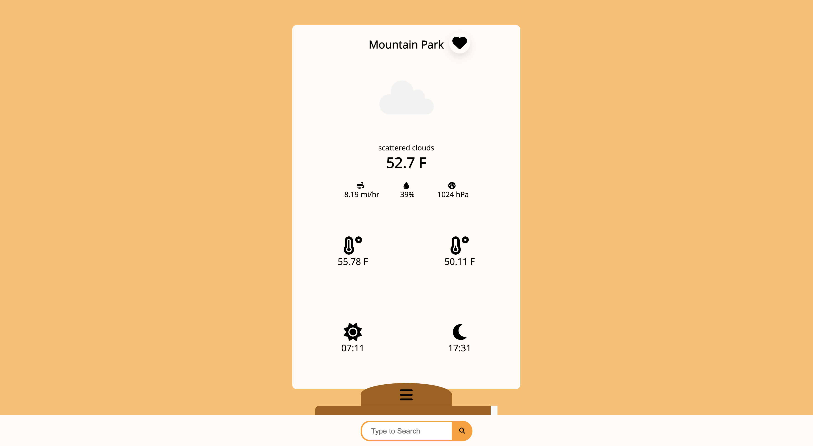

# Weather App

A simple web app. It makes geolocates the user on for the first API request, and allows users to search for weather forecasts thereafter. Users are able to save their favorite locations, and session data is managed using Redux Persist. The styling is mobile responsive.

## Technologies

-   Typescript
-   React.js/Redux
-   Redux Persist
-   React Router
-   Openweathermap API

## Installation

To install this app, clone my repo above. In your terminal, cd into the folder containing the code and run the following lines.

`npm i`

`npm start`

## Preview

